# Kestrel — Workflow & Pipeline Diagrams (Mermaid)

> Draft. Assumptions marked **[A]** — confirm/adjust. Renders in GitHub/VS Code Mermaid preview.

## 1. System Components

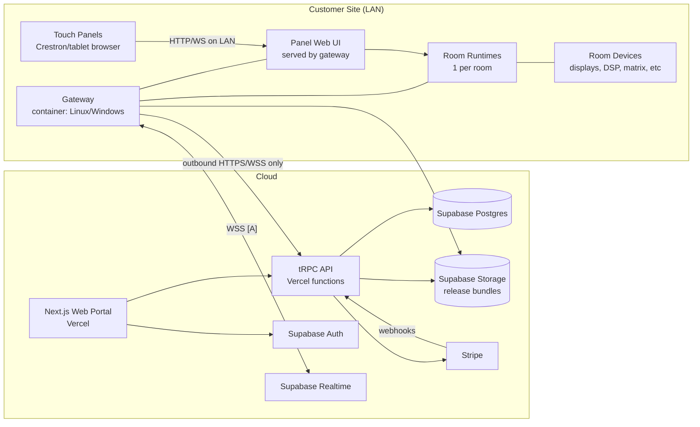

## 2. Gateway Enrollment (provisioning)

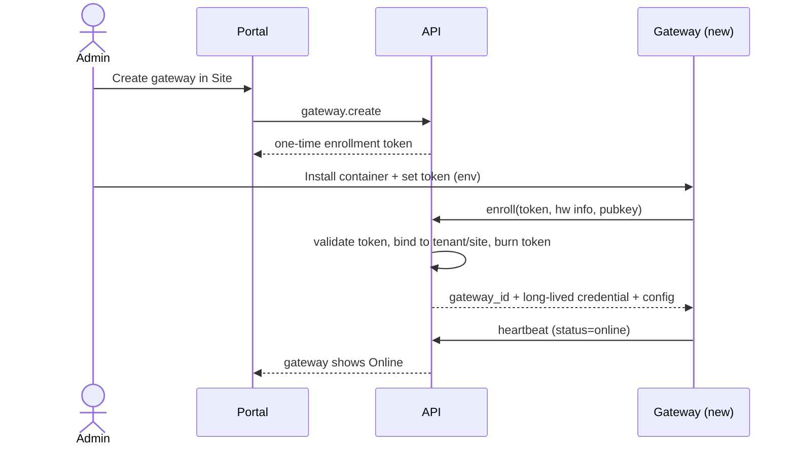

## 3. Deploy Pipeline (authoring → live room)

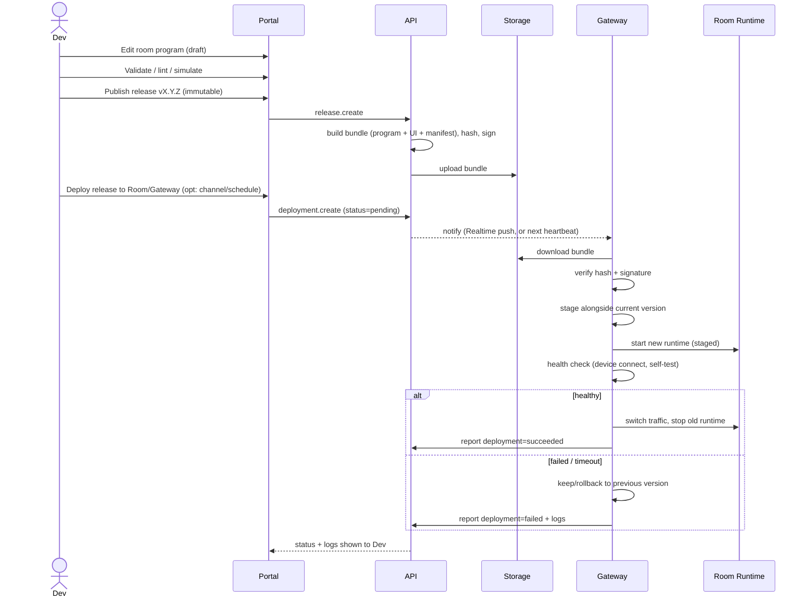

## 4. Deployment State Machine

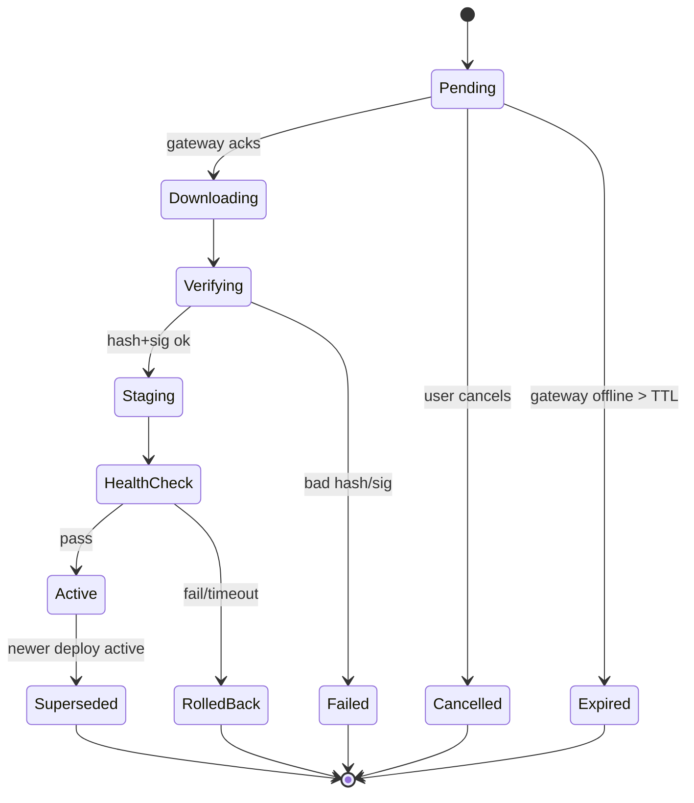

## 5. Runtime: Panel Interaction (LAN, works offline)

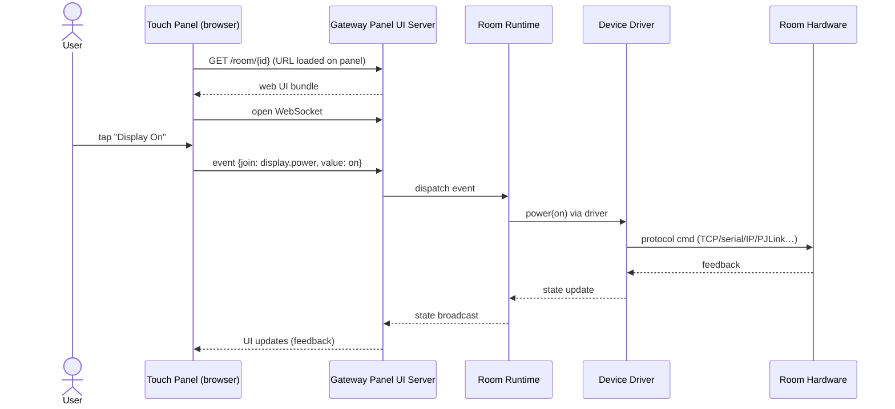

## 6. Monitoring / Telemetry

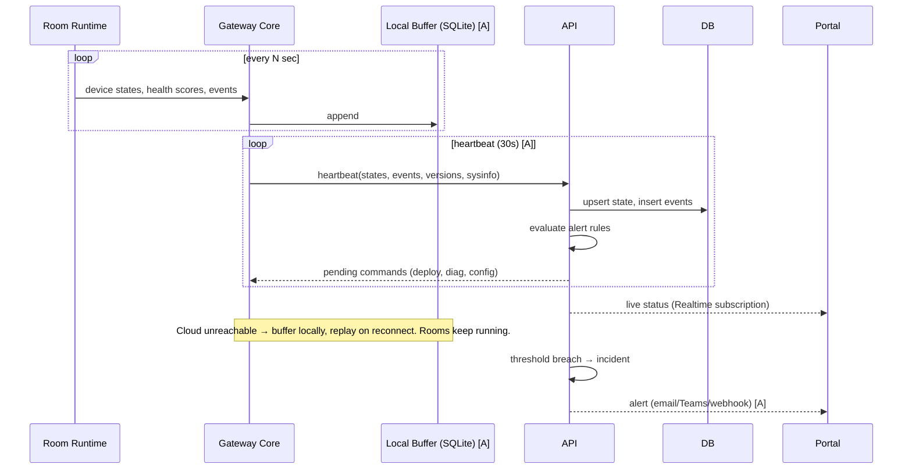

## 7. Remote Command / Diagnostics

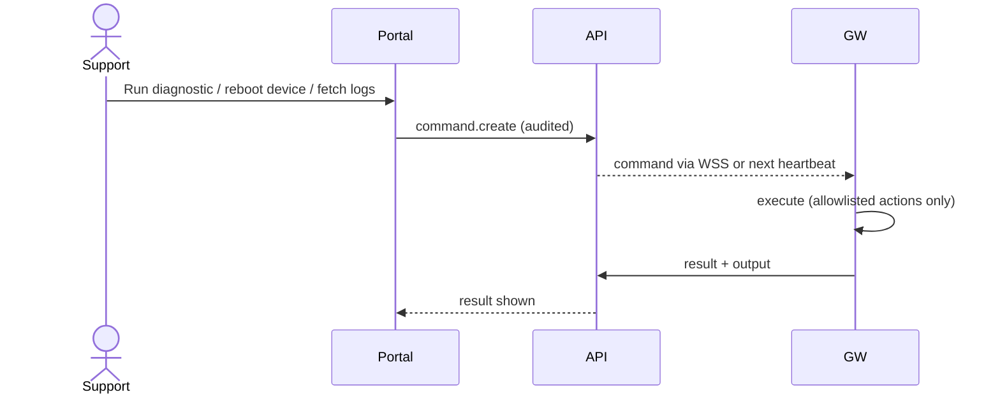

## 8. Core Domain Model (draft)

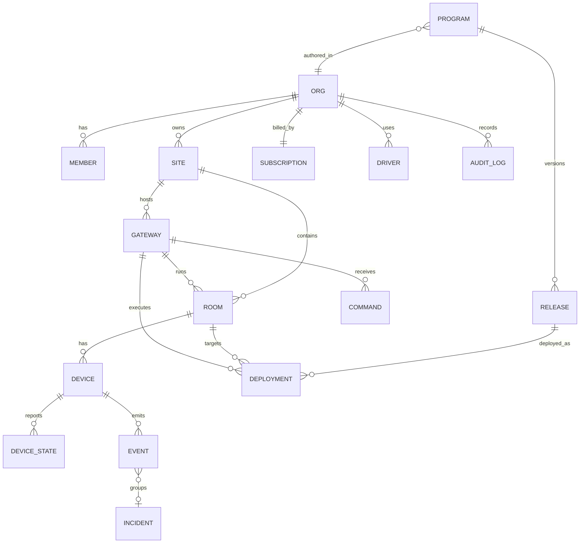

## 9. Kestrel's Own CI/CD (Vercel + Supabase + Gateway image)

```mermaid
flowchart LR
  PR[Feature branch PR] --> CI[CI: lint, typecheck, test, prisma validate]
  CI --> PREV[Vercel Preview Deploy<br/>+ Supabase preview branch [A]]
  PREV --> REVIEW[Review] --> MERGE[Merge to main]
  MERGE --> MIG[Prisma migrate deploy<br/>to prod Supabase]
  MIG --> PROD[Vercel Production]
  MERGE --> IMG[Build gateway image<br/>GitHub Actions]
  IMG --> REG[(Container Registry<br/>GHCR)]
  REG --> CH[Gateway release channel<br/>stable / beta]
  CH --> GWUP[Gateways self-update<br/>pull + swap + rollback]
```

## 10. Billing Flow

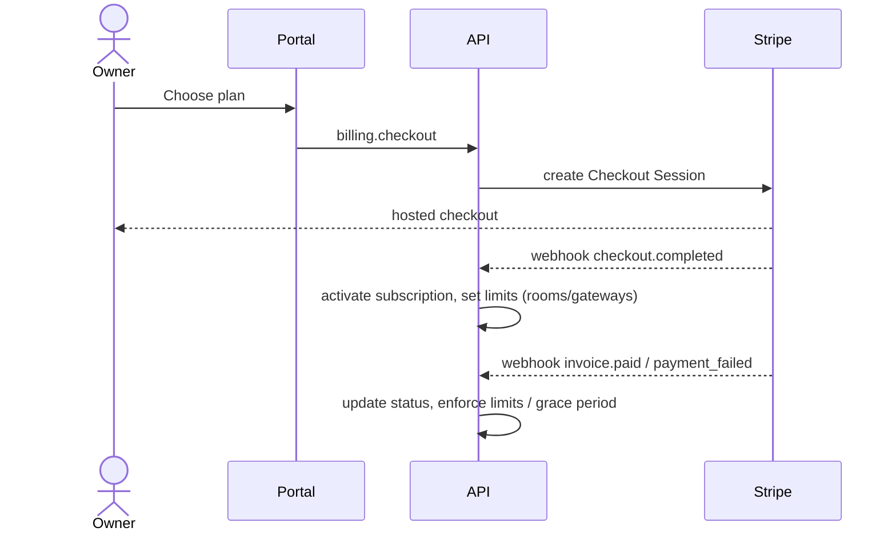

---

# Room Modelling (system-architecture-driven)

## 11. Room Authoring Workflow

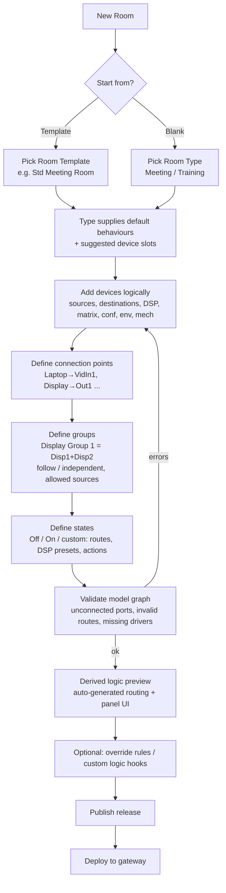

## 12. Room Model (class diagram)


Device categories: video source, audio source, conf camera, fixed camera, PTZ camera, auto-framing camera, reinforcement mic, voice-capture mic, conference system (MTR/Codec), video matrix (virtual/physical), audio matrix/DSP, video destination (display/projector/recorder/output), audio destination (speaker/output), conference output, environmental (lighting/HVAC/blinds), mechanical (lifter/screen).

## 13. Example Signal Graph (the "90% room")

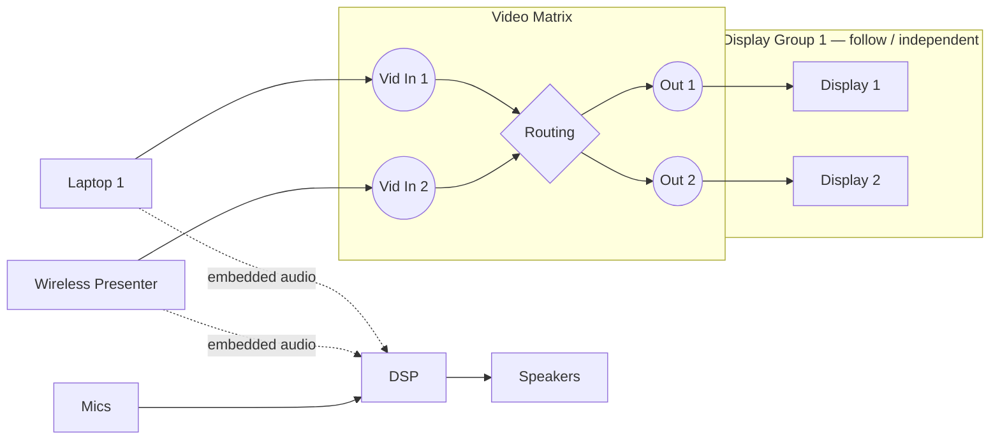

- Groups own source-select logic; matrix routes are _derived_ from the model, not hand-written.

## 14. Model → Logic Compile Pipeline

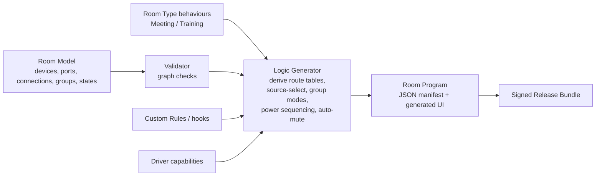

- Runtime = generic interpreter of the room program (no code-gen of per-room source)
- Edge cases handled by: custom rules → custom logic hook (sandboxed script) → escape hatch **[A]**

## 15. Runtime: Source Select on a Display Group

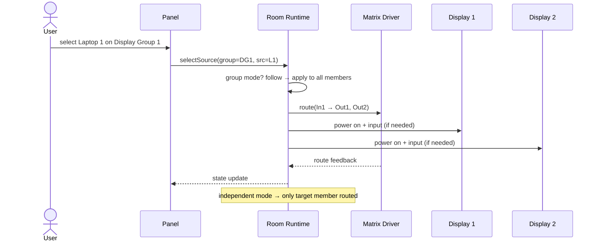

## 16. State Recall (Off / On / custom)

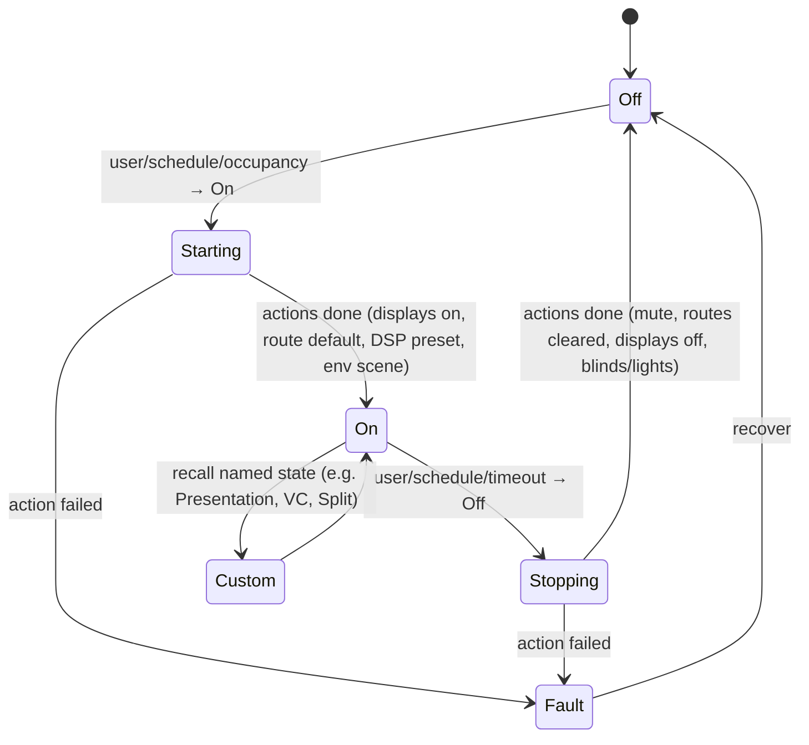

- State = ordered Action list (route, DSP preset, device cmd, delay, env), each with success/fail + timeout

---

# Functional (Intent-Based) UI

## 17. UI Layering

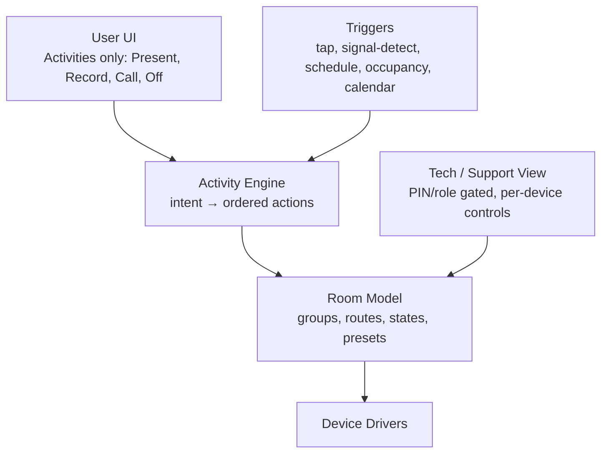

## 18. Activity Definition → Generated UI

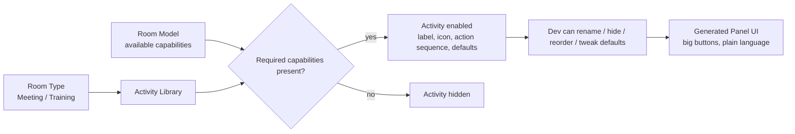

## 19. Example: "Present from Laptop" (1 tap)

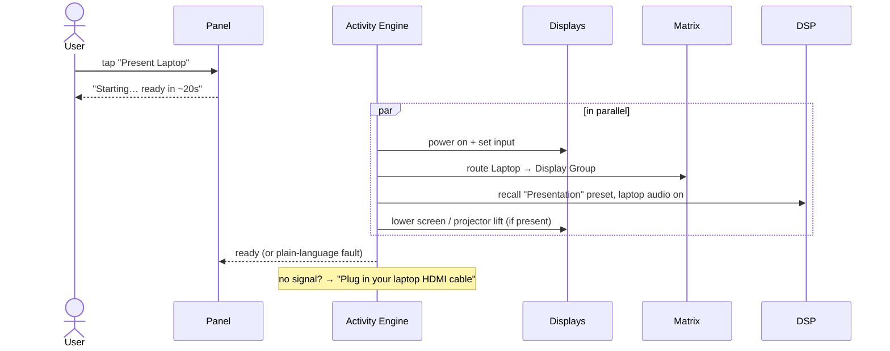

## 20. Example: "Record Lecture" (1 tap, or auto)

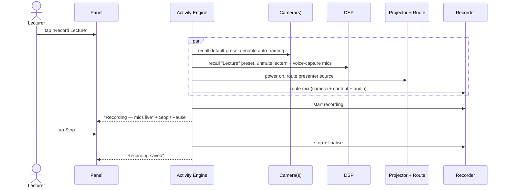

## 21. Auto Source Detection (walk-in)

```mermaid
stateDiagram-v2
  [*] --> RoomOff
  RoomOff --> Starting: signal detected on input [A] / tap
  Starting --> Presenting: display on + routed
  Presenting --> Prompt: 2nd source detected
  Prompt --> Presenting: keep current / switch to new (user choice)
  Presenting --> IdleWarn: no signal + no activity for T
  IdleWarn --> Presenting: user touches panel / signal returns
  IdleWarn --> RoomOff: countdown expires (auto-off)
```

- Timings: 2nd-source prompt auto-switches after 10s; idle warning 30s. No signal/occupancy detection → never auto-off.

---

# Sync, Combining, Access, Tiers

## 22. Deployment Sync / Drift Detection

```mermaid
stateDiagram-v2
  [*] --> InSync
  InSync --> PendingDeploy: cloud draft/release changed, not deployed
  PendingDeploy --> Deploying: deploy (now or scheduled)
  Deploying --> InSync: gateway reports active = desired
  Deploying --> Failed: verify/health fail → rollback
  Failed --> PendingDeploy: fix + redeploy
  InSync --> Drifted: gateway reports version/hash ≠ desired
  Drifted --> Deploying: re-deploy desired
  InSync --> Unknown: gateway offline
  Unknown --> InSync: gateway returns, hash matches
  Unknown --> Drifted: gateway returns, hash differs
```

- Desired (cloud) vs Reported (gateway heartbeat: release id + manifest hash) compared every heartbeat

## 23. Combined Rooms

```mermaid
stateDiagram-v2
  [*] --> Separate
  Separate --> Combined: combine trigger (tap / sensor / schedule)
  Combined --> Separate: uncombine
  state Combined {
    [*] --> Primary_Secondary
    Primary_Secondary: Primary drives; Secondary per config
    Primary_Secondary: video follows | blanks
    Primary_Secondary: audio follows | blanks
  }
  Separate --> Off_Reverted: on uncombine, secondary reverts to Off
```

- Combination config lives on the room set: roles, follow/blank per signal type, revert-to-off flag
- Secondary panel UIs mirror primary or show "Room combined — use {Primary}"

## 24. Panel Access

```mermaid
flowchart TD
  P[Panel/Tablet loads room URL] --> T{Source IP in trusted list?<br/>MAC match best-effort}
  T -->|yes| U[User UI, no auth]
  T -->|no| C{Room PIN enabled?}
  C -->|no| U
  C -->|yes| PIN[PIN prompt] --> U
  U --> TECH[Tech view tap] --> PIN2[Tech PIN always required] --> TV[Tech/support view]
```

## 25. Tiers & Entitlements

```mermaid
flowchart LR
  TR[Trial<br/>5 rooms · 30d · control+monitoring] -->|expires| BA
  TR -->|upgrade| PRO
  BA[Basic<br/>per room · control only<br/>buy marketplace templates] -->|upgrade| PRO
  PRO[Pro<br/>per room · control + monitoring<br/>publish to marketplace · driver creation]
  ENT{{Entitlement check<br/>tRPC middleware + gateway config}} --- BA
  ENT --- PRO
  ENT --- TR
```

- Monitoring off ⇒ gateway stops sending/cloud stops ingesting for that room; control unaffected

## 26. Simulator (browser)

```mermaid
flowchart LR
  MODEL[Room model draft] --> ENG[engine package<br/>same code as gateway]
  ENG <--> SIM[Simulated device drivers]
  ENG <--> PUI[Generated Panel UI]
  SIM --> VIZ[Signal-flow / device state visualiser]
  PUI -. user taps .-> ENG
  VIZ -. inject faults: no signal, device offline .-> SIM
```
