# Kestrel — Workflow & Pipeline Diagrams (Mermaid)

> Brought up to date with what is built on 2026-09-28 (sections 2, 3, 4, 8, 9, 23 and 25 were rewritten; 27 to 30 are new). **[A]** marks an assumption or something not built. Renders in GitHub/VS Code Mermaid preview. Decisions behind each diagram: `docs/decisions.md`; build status: `docs/plan.md`.

## 1. System Components

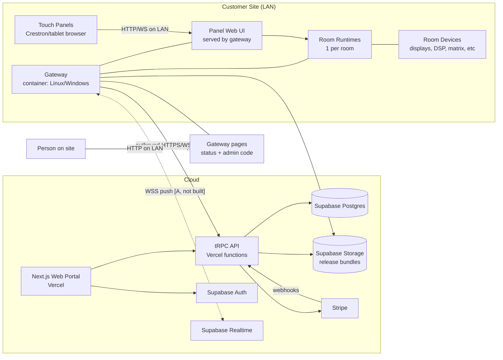

## 2. Gateway Enrollment (provisioning)

Two ways in. Both end with the ordinary one-time-token enrolment; the second exists so an install with no token is visible instead of silently failing (`docs/decisions.md` T-1 to T-5).

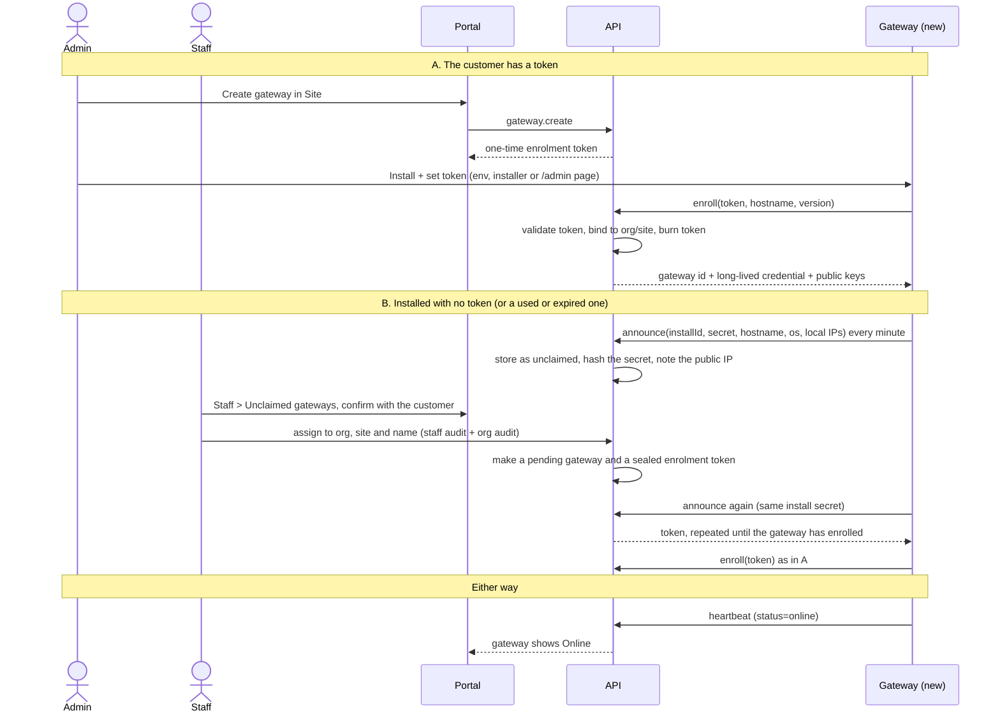

## 3. Deploy Pipeline (authoring → live room)

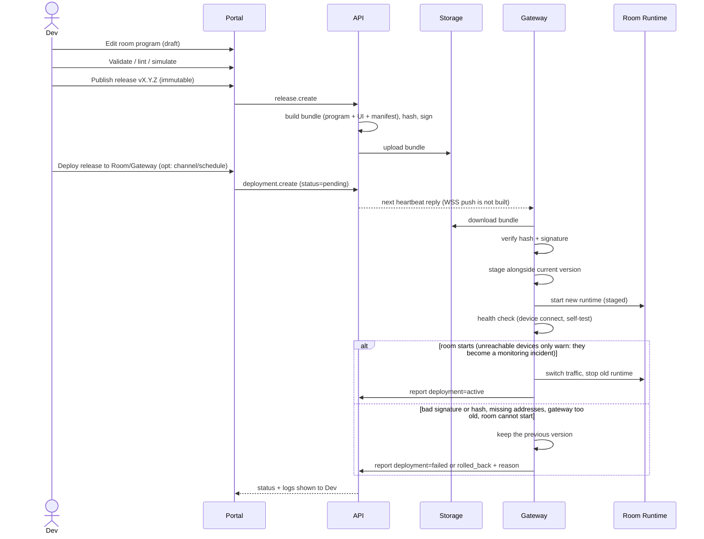

## 4. Deployment State Machine

The gateway reports `downloading`, `verifying`, `staging`, `health_check`, `active`, `failed` and `rolled_back` (`DeploymentStage`); the cloud adds the states that need no gateway.

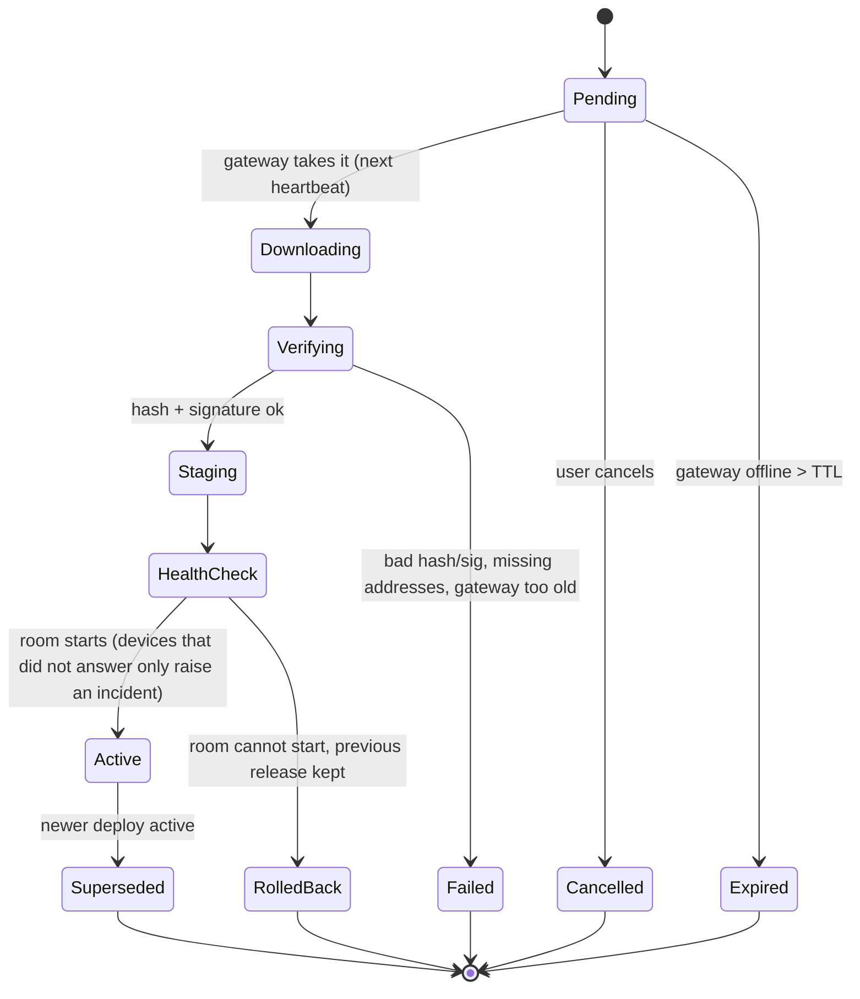

## 5. Runtime: Panel Interaction (LAN, works offline)

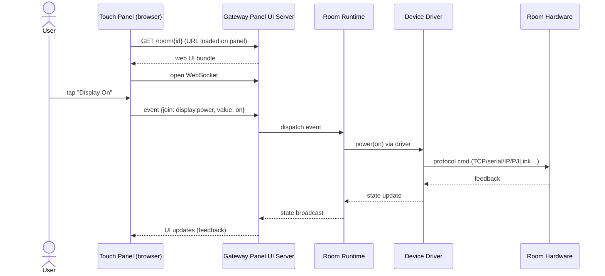

## 6. Monitoring / Telemetry

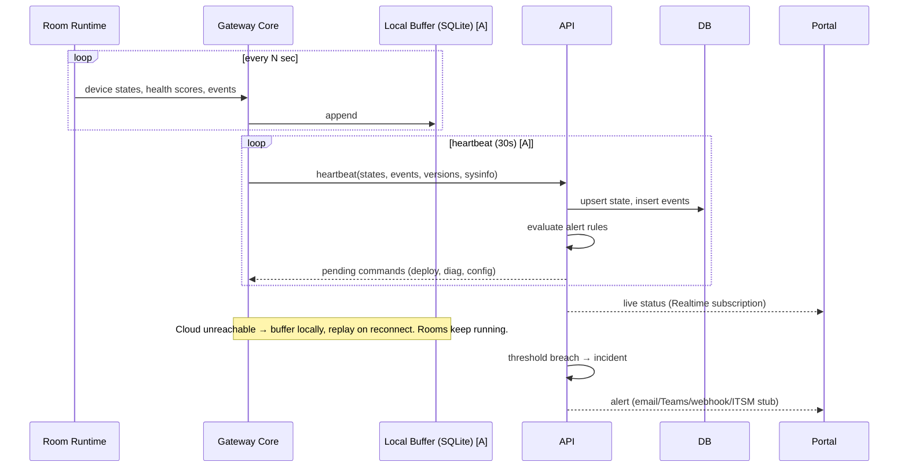

What a heartbeat carries per device: online, driver, **feedback** (power, input, mute, ... each change also logged for the history chart), **firmware**, and **details** (see 30). A gateway is never sent a reply it cannot read: it advertises `features` in the heartbeat (`bindings`, `self-update`, ...).

## 7. Remote Command / Diagnostics

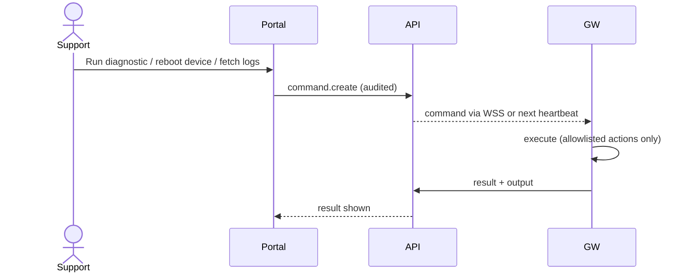

A gateway **update** is not a command (commands are room-scoped and an older gateway cannot read new types): it is desired state on the gateway record, see 27.

## 8. Core Domain Model (main entities as built)

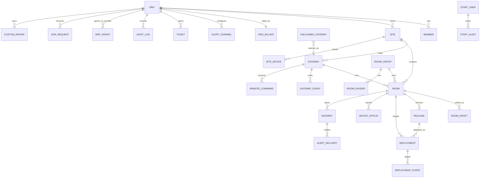

Devices, ports, connections, groups and activities live inside the room's draft and signed release (the model, diagram 12), not as tables.

## 9. Kestrel's Own CI/CD (Vercel + Supabase + Gateway image)

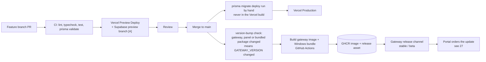

Deploy the web app before gateways. Gateway image and bundle builds skip changes that only touch `packages/db`.

## 10. Billing Flow

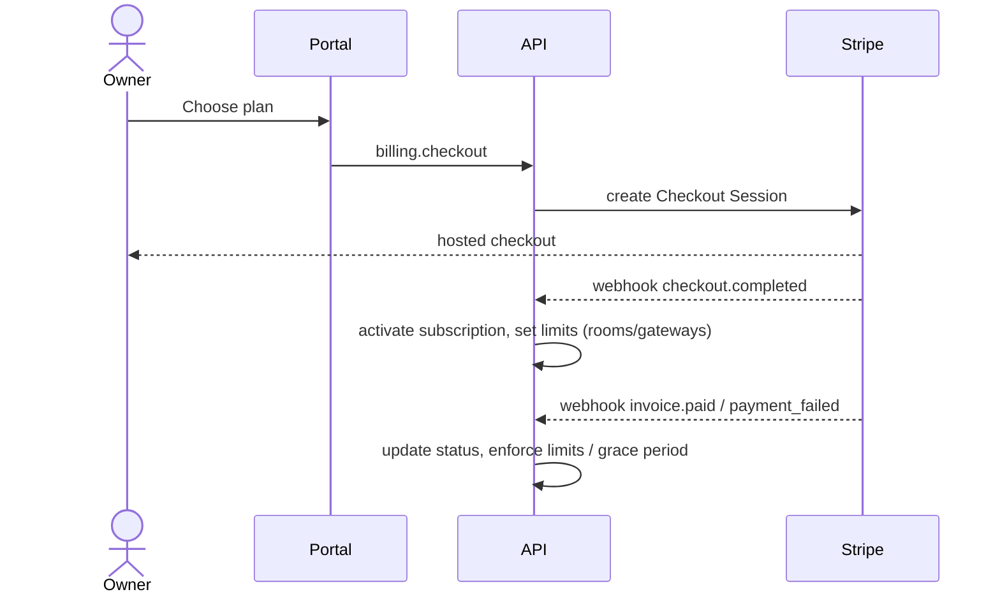

---

# Room Modelling (system-architecture-driven)

## 11. Room Authoring Workflow

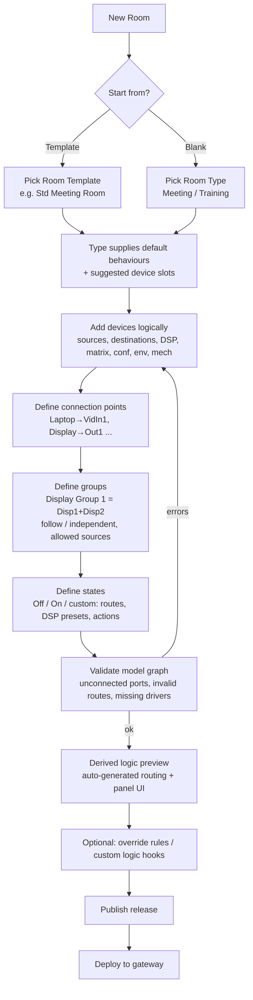

## 12. Room Model (class diagram)

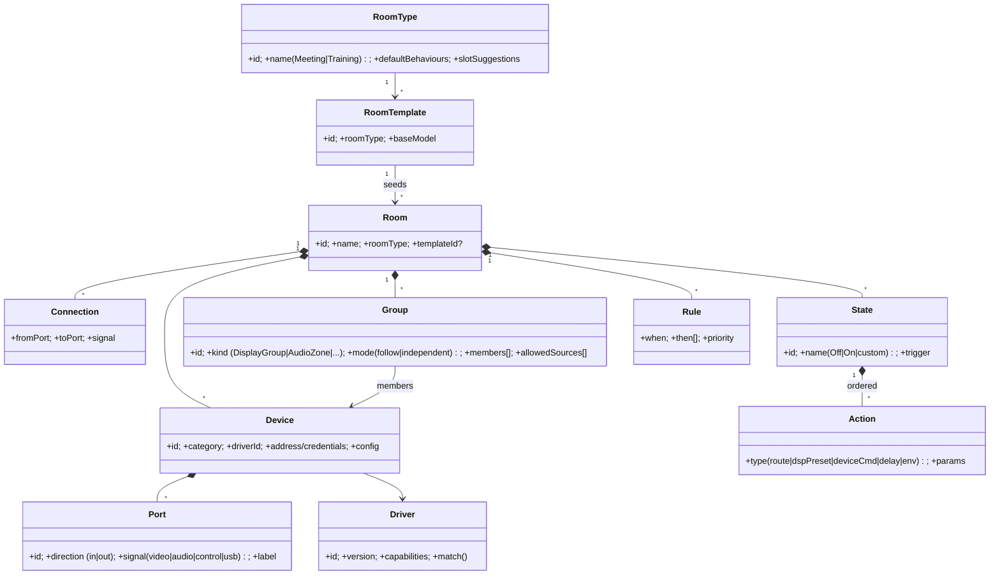

Device categories: video source, audio source, conf camera, fixed camera, PTZ camera, auto-framing camera, reinforcement mic, voice-capture mic, conference system (MTR/Codec), video matrix (virtual/physical), audio matrix/DSP, video destination (display/projector/recorder/output), audio destination (speaker/output), conference output, environmental (lighting/HVAC/blinds), mechanical (lifter/screen).

## 13. Example Signal Graph (the "90% room")

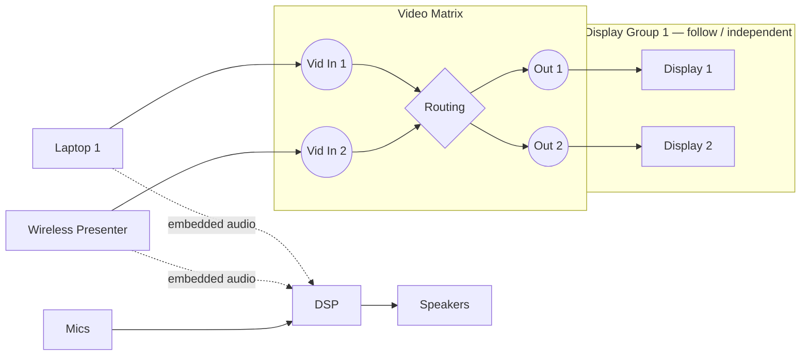

- Groups own source-select logic; matrix routes are _derived_ from the model, not hand-written.

## 14. Model → Logic Compile Pipeline

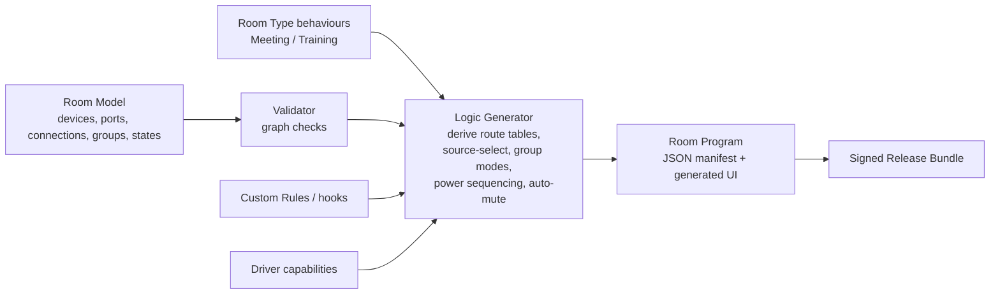

- Runtime = generic interpreter of the room program (no code-gen of per-room source)
- Edge cases handled by: custom rules → custom logic hook (sandboxed script) → escape hatch **[A]**

## 15. Runtime: Source Select on a Display Group

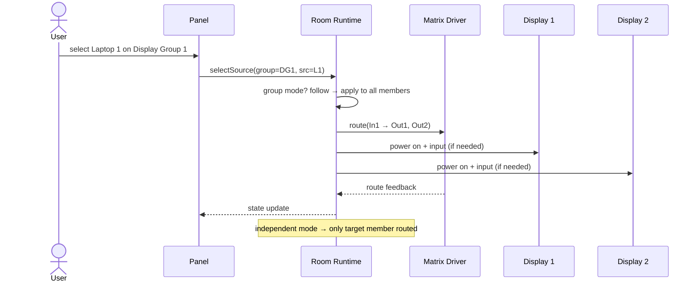

## 16. State Recall (Off / On / custom)

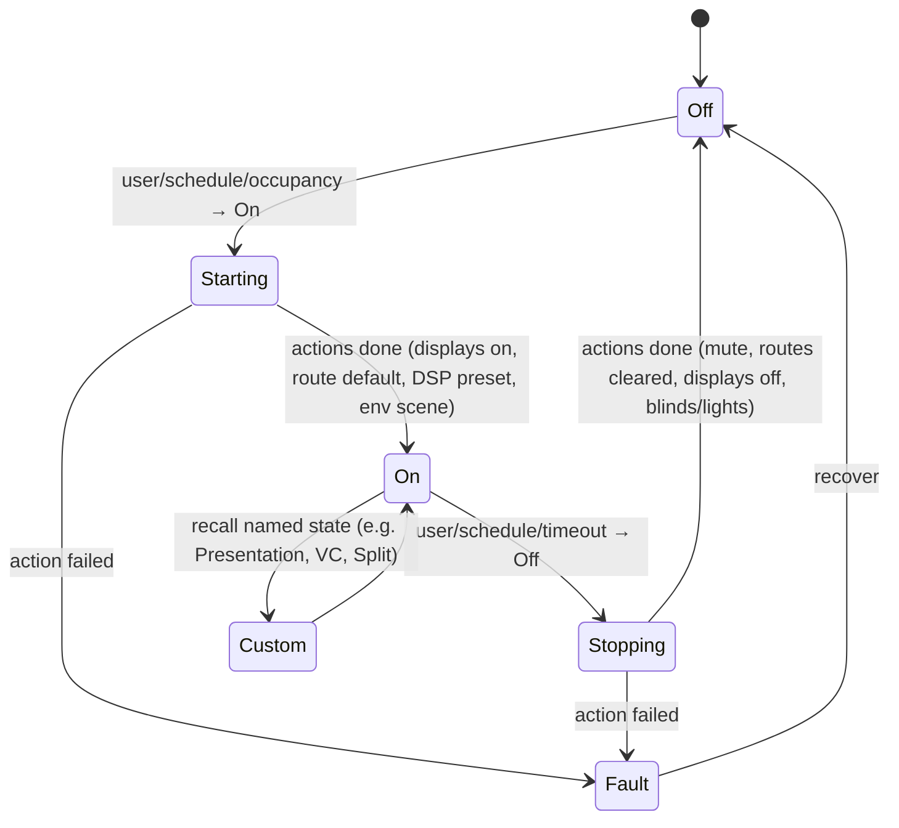

- State = ordered Action list (route, DSP preset, device cmd, delay, env), each with success/fail + timeout

---

# Functional (Intent-Based) UI

## 17. UI Layering

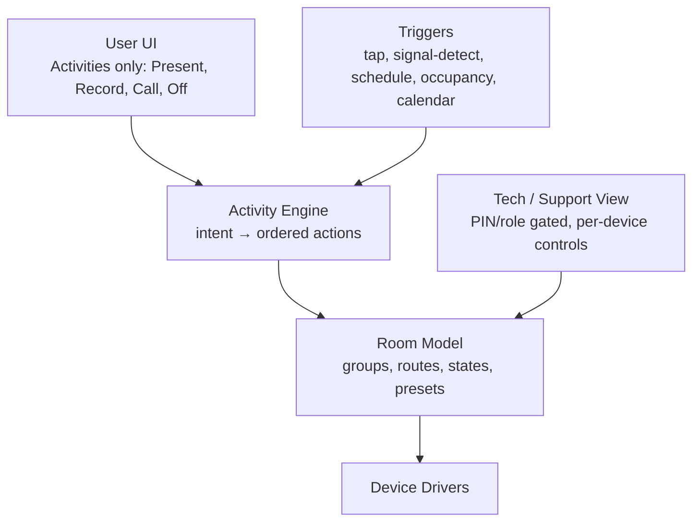

## 18. Activity Definition → Generated UI

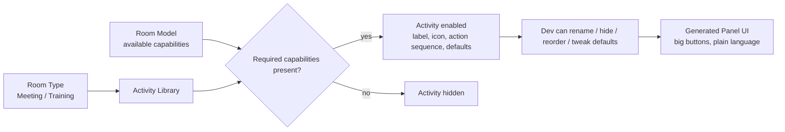

## 19. Example: "Present from Laptop" (1 tap)

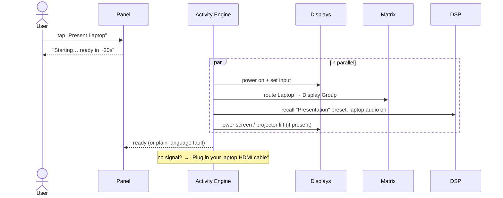

## 20. Example: "Record Lecture" (1 tap, or auto)

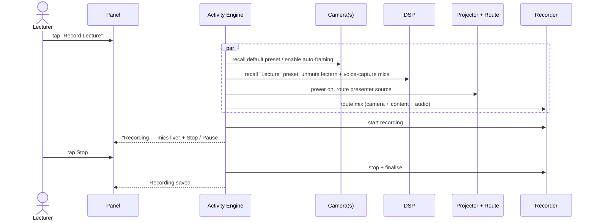

## 21. Auto Source Detection (walk-in)

```mermaid
stateDiagram-v2
  [*] --> RoomOff
  RoomOff --> Starting: signal detected on input [A] / tap
  Starting --> Presenting: display on + routed
  Presenting --> Prompt: 2nd source detected
  Prompt --> Presenting: keep current / switch to new (user choice)
  Presenting --> IdleWarn: no signal + no activity for T
  IdleWarn --> Presenting: user touches panel / signal returns
  IdleWarn --> RoomOff: countdown expires (auto-off)
```

- Timings: 2nd-source prompt auto-switches after 10s; idle warning 30s. No signal/occupancy detection → never auto-off.

---

# Sync, Combining, Access, Tiers

## 22. Deployment Sync / Drift Detection

```mermaid
stateDiagram-v2
  [*] --> InSync
  InSync --> PendingDeploy: cloud draft/release changed, not deployed
  PendingDeploy --> Deploying: deploy (now or scheduled)
  Deploying --> InSync: gateway reports active = desired
  Deploying --> Failed: verify/health fail → rollback
  Failed --> PendingDeploy: fix + redeploy
  InSync --> Drifted: gateway reports version/hash ≠ desired
  Drifted --> Deploying: re-deploy desired
  InSync --> Unknown: gateway offline
  Unknown --> InSync: gateway returns, hash matches
  Unknown --> Drifted: gateway returns, hash differs
```

- Desired (cloud) vs Reported (gateway heartbeat: release id + manifest hash) compared every heartbeat

## 23. Combined Rooms

Built as room groups with movable walls (`docs/room-groups.md`, decisions C-1 to C-14). A combined room is an ordinary room with its own program; the gateway decides which one runs.

```mermaid
stateDiagram-v2
  [*] --> Separate
  Separate --> Combined: a wall opens (panel "Link rooms", portal, sensor later)
  Combined --> Separate: the wall closes
  state Combined {
    [*] --> Live
    Live: the combined room runs, members suspended
    Live: each wall has open and close settings
    Live: off, on, follow or restore
  }
  Combined --> Combined: another wall moves, a different combined room runs
```

- The gateway owns which walls are open (saved locally, works with no cloud); the cloud sends the group in the config and the heartbeat reports open walls
- Every member's panel mirrors the live combined room; a group deploys as one action; the browser simulator runs the same `GroupController`
- Not built: sensors, disconnecting a suspended room's devices, keeping "restore" across restarts

## 24. Panel Access

```mermaid
flowchart TD
  P[Panel/Tablet loads room URL] --> T{Source IP in trusted list?<br/>MAC match best-effort}
  T -->|yes| U[User UI, no auth]
  T -->|no| C{Room PIN enabled?}
  C -->|no| U
  C -->|yes| PIN[PIN prompt] --> U
  U --> TECH[Tech view tap] --> PIN2[Tech PIN always required] --> TV[Tech/support view]
```

## 25. Tiers & Entitlements

```mermaid
flowchart LR
  TR[Trial<br/>5 rooms · 30 days · control + monitoring] -->|ends| BA
  TR -->|upgrade| PRO
  BA[Basic<br/>per room · monitoring only<br/>email alerts · up to 500 rooms] -->|upgrade| PRO
  PRO[Pro<br/>per room · control + monitoring<br/>all alert channels · marketplace · custom drivers]
  PRO -->|lapses| BA
  ENT{{Entitlement check<br/>tRPC middleware}} --- BA
  ENT --- PRO
  ENT --- TR
  ENT -->|control flag in every heartbeat reply| GATE[Gateway ControlGate<br/>refuses every command when control is off]
```

- Without control a room is a monitored room: devices, bindings, watch points and alert rules; publishing and deploying stay open so monitoring can start (TM-14, TM-15)
- An ended trial is monitoring only: no alerts, no analytics, no new rooms (TM-5)
- Control is enforced on the gateway, not only hidden in the portal

## 26. Simulator (browser)

```mermaid
flowchart LR
  MODEL[Room model draft] --> ENG[engine package<br/>same code as gateway]
  ENG <--> SIM[Simulated device drivers]
  ENG <--> PUI[Generated Panel UI]
  SIM --> VIZ[Signal-flow / device state visualiser]
  PUI -. user taps .-> ENG
  VIZ -. inject faults: no signal, device offline .-> SIM
```

---

# Gateway operations

## 27. Portal-driven Gateway Update

Decisions S-1 to S-8. An update is desired state on the gateway record (`updateNotBefore`, `updateVersion`, `autoUpdate`), not a command.

```mermaid
sequenceDiagram
  actor Owner as Owner / dev
  participant Portal
  participant API
  participant GW as Gateway (0.2.5+)
  participant Host as Release host (GitHub)
  participant Inst as Installer (Windows task or Watchtower)
  Owner->>Portal: Update now, at a time, cancel, or policy Automatic
  Portal->>API: store the request (audited)
  Note over API: Automatic makes the request itself when the channel has a newer version
  GW->>API: heartbeat (features include self-update)
  API-->>GW: updateOrder {version, bundle sha256 + size} once due and behind
  alt Windows
    GW->>API: GET /bundle
    API-->>GW: short-lived signed asset link + digest
    GW->>Host: download
    GW->>GW: check SHA-256 against the order, stage, refresh update.ps1
    GW->>Inst: schtasks /Run
    Inst->>Inst: stop service, swap, start, wait for /health
    Inst-->>GW: result (old version put back if it does not answer)
  else Docker
    GW->>Inst: Watchtower HTTP API (localhost)
  else no updater configured
    GW->>API: state=unsupported with a reason
  end
  GW->>API: progress in heartbeats: downloading, staged, applying, failed
  Note over API: success = the reported version reaches the target, a failure is not retried in a loop
```

- Older than 0.2.5: one manual update first ("needs one manual update"). Manual by default, so a fleet never changes unasked
- Trust gap (S-7): whoever can publish to `gateway-stable` can put code on gateways. Independent signing is not built

## 28. Unclaimed Gateway

The state machine behind diagram 2, path B (decisions T-1 to T-5).

```mermaid
stateDiagram-v2
  [*] --> Open: first announcement
  Open --> Claimed: staff assign org, site and name
  Claimed --> Open: staff take back (never connected)
  Open --> Dismissed: staff dismiss (announces hourly)
  Claimed --> Enrolled: gateway presents its secret, gets the token, enrols
  Open --> Removed: staff remove, or not seen for 30 days
  Claimed --> Removed: enrolled claims are deleted after 7 days
  Enrolled --> [*]
```

- Guardrails on an endpoint anyone can reach: 4 KB payload, secret stored hashed, 500 rows at most, 10 new installs a day per public address
- Unclaimed gateways cannot be updated from the portal: no organisation owns them (T-5)

## 29. Gateway Local Pages

Decisions U-1 to U-6. Served by the gateway on its panel port; plain HTML, no scripts.

```mermaid
flowchart TD
  ANY[Anyone on the LAN] --> ST["/ status page<br/>connected or not, version, last contact,<br/>rooms with panel links, install ID if unclaimed"]
  ADM[Person on site] --> CODE{"/admin: admin code<br/>(admin-code.txt in the data folder)"}
  CODE -->|5 wrong: locked 1 min| CODE
  CODE -->|right| SESS[30 minute session]
  SESS --> TOK[Enter enrolment token]
  SESS --> RST[Reset: type RESET]
  TOK --> TRY{Cloud accepts it?}
  TRY -->|no| KEEP[Nothing changes, reason shown]
  TRY -->|yes| WIPE
  RST --> WIPE[Forget the old organisation:<br/>rooms, releases, addresses, phone secrets,<br/>groups, unsent events]
  WIPE --> NEWID[Reset only: new install ID] --> ANN[Announce as unclaimed, diagram 28]
  WIPE --> ENR[Token path: enrolled in the new organisation]
```

## 30. Device Details, Feedback and Firmware

Decisions R-1 to R-8, TM-18 to TM-20 and the firmware step.

```mermaid
flowchart LR
  DRV[Driver read-backs<br/>power, input, mute, level, occupancy] --> HB
  DRV --> DET[Details: titled sections, rows, tables<br/>serial, MAC, program, IP table, stream status]
  DRV --> FW[Firmware version]
  DET -->|on change and every 5 min, dropped if invalid| HB[Heartbeat]
  FW --> HB
  HB --> API[API keeps the last details, feedback and firmware<br/>DeviceStatus]
  HB -->|each change| EV[device.feedback event, 90 day retention]
  API --> ROOMMON[Room monitoring page: click a device to expand]
  API --> FWPAGE[Firmware page: mixed versions flagged]
  EV --> HIST[History chart: minutes per value per day]
```
